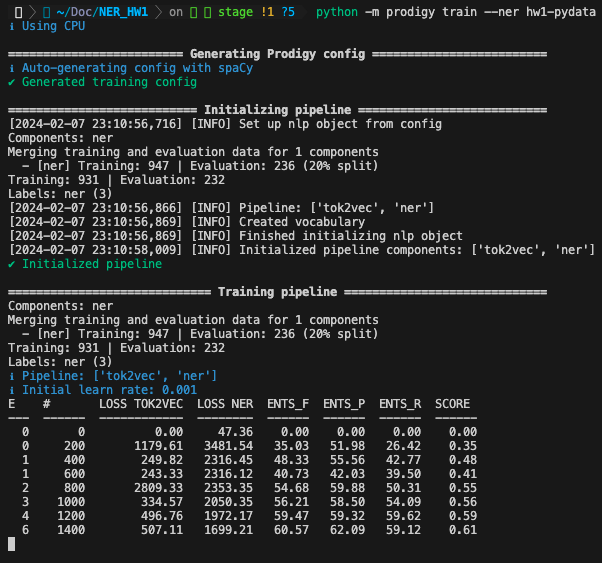
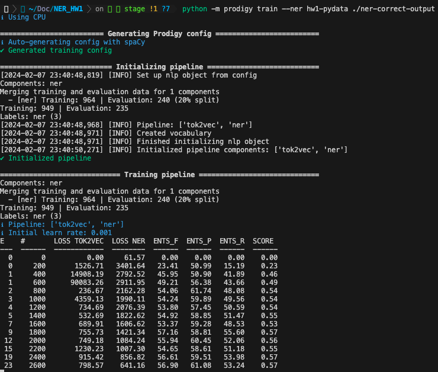

# Named Entity Recognition (NER) Modeling

## Approach and Reasoning

In order to train the most accurate model, I first set a foundation for annotations by using `ner.manual`. This process can be reproduced by cloning this repository and running the following command.
```zsh
python -m prodigy ner.manual hw1-pydata blank:en pydata-nyc-2023.jsonl --label DISH,INGREDIENT,EQUIPMENT
```
This manual annotation process provides me with full control over the annotation process. It allows for incremental training, meaning I can intermittently annotate entities, improving the model's accuracy as time allows. 
While there are many benefits to using this interface, there are a few disadvantages. It is a labor-intensive process, requiring me to manually label each entity. This can become a real nuisance when considering large data sets. It is also prone to errors and variability as I have to double and triple-check that my annotations are accurate before moving onto the next entry. Subjectivity is also a factor as it is up to me to decide how to annotate each entity. The possibility of bias also exists, whether conscious or not. Mistakes, subjectivity and bias can each have a negative impact on the accuracy of the model.

After manually annotating numerous entries, I trained the model using 
```zsh
python -m prodigy train --ner hw1-pydata ./ouput
```
This gave me a best F1 score of 60.57%. 


In order to train the model further, I used `ner.correct` and trained my model agaist the `gtp3-5-zeroshot.jsonl` dataset using
```zsh
python -m prodigy ner.correct hw1-pydata en_core_web_sm gpt3-5-zeroshot.jsonl --label DISH,INGREDIENT,EQUIPMENT
```

The updated scoring came in with an F1 of 57.16%. 


It is likely that the scoring would improve with additional corrections, but it actually reduced the scoring during this run. This is likely due to the fact that  
the annotations were inconsistent and there weren't but ~20 corrected annotations. 

I am looking forward to experimenting futher with training models. I plan to research additional spaCy pipelines to evaluate what effects those have on the data.


## Annotation Guidelines

1. **Entity Categories**: The entity categories that I identified.
   - DISH: The name of a dish (e.g. Spaghetti, Carbonara, Macaroni and cheese, etc.).
   - INGREDIENT: The name of an ingredient (e.g. garlic powder, salt, paprika, etc.).
   - EQUIPMENT: Kitchen applicances, utensils or tools used in the process of cooking (e.g. Hand mixer, blender, spatula, etc.)

2. **Annotation Schema**:
   - Highlight spans of text corresponding to the entities.
   - Use a consistent annotation format for each entity category.
   - Ensure that entities are annotated accurately, without overlapping or omitting relevant text.

3. **Entity Boundaries**:
   - Entities should be annotated with their full spans, without including extraneous characters.
   - Avoid splitting entities into multiple annotations unless necessary. For example, `macaroni and cheese` would be one annotation. However, `meat and vegetables` would be two separate annotations, `meat` and `vegetables`.

4. **Contextual Guidelines**:
   - Consider context clues when identifying entities.
   - Use your best judgement when evaluating surrounding words or phrases. Identify how including these surrounding words or phrases can help determine entity boundaries or categories.

5. **Special Cases**:
   - For words or phrases that might fall into multiple categories, try to prioritize the intent, given the context clues (e.g. "I want to make meatloaf but I don't know if I should go with strictly `hamburger` or also mix in `pork sausage`". Given this phrase, `hamburger` and `pork sausage` are intended to be referenced as ingredients but externally exist as dishes on thier own.).
   - For entities with unconventional spelling, consider the intent and how country of origin might be a factor (e.g. omelet vs. omelette, barbecue vs. barbeque).

6. **Consistency and Quality Control**:
   - Consistency across anotators is crucial in developing a more accurate NER model. If one annotator is categorizing entities differently than another, accuracy will take a hit.
   - When discrepancies between annotators' judgments exist, refer to these annotation guidelines.
   - If we wanted to train the most accurate model, implementing a review process or quality control checks would be necessary in ensuring annotation accuracy.

7. **Tool Usage**:
   - When using `ner.manual`, first click the annotation before clicking the entity. This decreases mistakes and increases annotation velocity.
   - Before navigating away from the page, ensure you click the `Save` icon, indicated by the floppy disk icon.